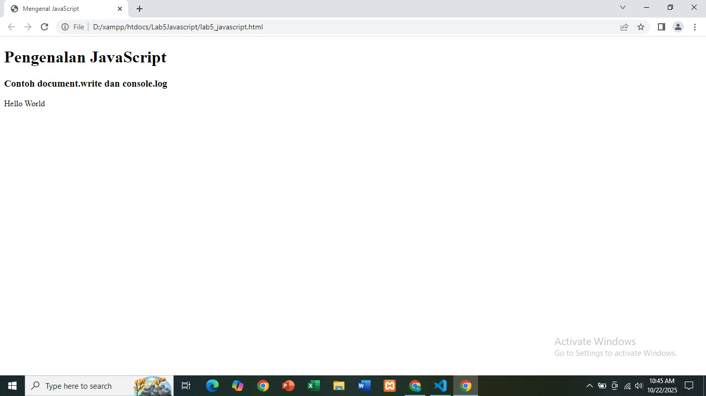
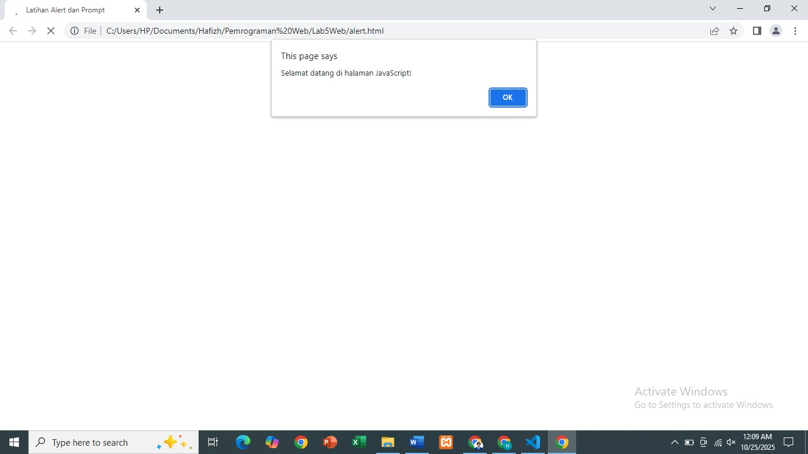

# Praktikum 5: JavaScript
**Nama:** Muhammad Hafizh Alfauzi

**NIM:** 312410501  

**Kelas:** TI.24.A5  

**Mata Kuliah:** Pemrograman Web  

**Dosen Pengampu:** Agung Nugroho, S.Kom., M.Kom  

---

## Tujuan Praktikum
1. Memahami dasar sintaks dan konsep JavaScript.  
2. Menggunakan JavaScript untuk memanipulasi elemen HTML.  
3. Membuat interaksi sederhana melalui event dan form input.  
4. Menerapkan validasi data menggunakan JavaScript.

---

## Langkah 1: Pengenalan JavaScript
**File:** `lab5_javascript.html`

### 🔹 Kode Program:
```html
<script>
    let nama = prompt("Masukkan nama Anda:");
    document.write("Halo, " + nama + "<br>");
    document.write("Hello World");
    console.log("Hello World");
</script>
````

### Hasil:

>  

### Penjelasan:

* `prompt()` meminta input nama dari pengguna.
* `document.write()` menampilkan teks di halaman.
* `console.log()` menampilkan pesan di konsol browser.

---

## Langkah 2: Alert dan Prompt

**File:** `alert.html`

### 🔹 Kode Program:

```html
<script>
    alert("Selamat datang di halaman JavaScript!");
    let nama = prompt("Masukkan nama Anda:");
    document.write("Halo, " + nama + "! Selamat belajar JavaScript");
</script>
```

### Hasil:

>  

### Penjelasan:

* `alert()` menampilkan pesan pop-up ke pengguna.
* `prompt()` menerima input dari pengguna.
* Output muncul langsung di halaman setelah klik “OK”.

---

## Langkah 3: Fungsi dan Tombol OnClick

**File:** `fungsi.html`

### 🔹 Kode Program:

```html
<script>
    function sapaUser() {
        let nama = prompt("Masukkan nama Anda:");
        alert("Halo, " + nama + "! Selamat datang di JavaScript");
    }
</script>

<button onclick="sapaUser()">Klik untuk Sapa</button>
```

### Hasil:

>  

### Penjelasan:

* `function` digunakan untuk mendefinisikan blok kode yang bisa dipanggil ulang.
* `onclick` memicu fungsi saat tombol diklik.

---

## Langkah 4: Operasi Aritmatika dan Kondisi If-Else

**File:** `kondisi.html`

### 🔹 Kode Program:

```html
let angka1 = parseFloat(prompt("Masukkan angka pertama:"));
let angka2 = parseFloat(prompt("Masukkan angka kedua:"));

let hasilTambah = angka1 + angka2;

if (hasilTambah > 100) {
    document.write("Hasil penjumlahan lebih besar dari 100 ✅");
} else if (hasilTambah == 100) {
    document.write("Hasil penjumlahan sama dengan 100 ⚖️");
} else {
    document.write("Hasil penjumlahan kurang dari 100 ❌");
}
```

### Hasil:

>  
>  
>  


### Penjelasan:

* `parseFloat()` mengubah input teks menjadi angka.
* `if`, `else if`, dan `else` digunakan untuk logika percabangan.
* Program menampilkan hasil sesuai nilai penjumlahan.

---

## Langkah 5A: Switch Case

**File:** `switch.html`

### 🔹 Kode Program:

```html
let hari = prompt("Masukkan nama hari (Senin, Selasa, Rabu, dst):");

switch (hari.toLowerCase()) {
    case "senin":
        document.write("Hari ini kamu harus semangat kerja 💪");
        break;
    case "jumat":
        document.write("Hari Jumat penuh berkah 🌙");
        break;
    case "minggu":
        document.write("Hari Minggu waktunya istirahat 😴");
        break;
    default:
        document.write("Nama hari tidak valid ❌");
}
```

### Hasil:

>  

### Penjelasan:

* `switch` digunakan untuk mengecek banyak kondisi dengan cara yang rapi.
* `toLowerCase()` menjadikan input huruf kecil agar mudah dibandingkan.

---

## Langkah 5B: Form Input JavaScript

**File:** `form.html`

### 🔹 Kode Program:

```html
function tampilData() {
    let nama = document.getElementById("nama").value;
    let umur = document.getElementById("umur").value;
    let hasil = "Halo, " + nama + "! Umur kamu " + umur + " tahun.";
    document.getElementById("output").innerHTML = hasil;
}
```

### Hasil:

>  

### Penjelasan:

* `getElementById()` mengambil nilai input dari form.
* `innerHTML` menampilkan hasil di elemen HTML dengan id `output`.
* Tombol dengan `onclick="tampilData()"` memicu fungsi saat diklik.

---

## Langkah 6: Validasi Form

**File:** `validasi.html`

### 🔹 Kode Program:

```html
function validasiForm() {
    let nama = document.getElementById("nama").value;
    let email = document.getElementById("email").value;
    let umur = document.getElementById("umur").value;

    if (nama == "") {
        alert("Nama wajib diisi!");
        document.getElementById("nama").focus();
        return false;
    }
    if (email == "") {
        alert("Email wajib diisi!");
        document.getElementById("email").focus();
        return false;
    }
    if (umur == "" || umur <= 0) {
        alert("Umur harus diisi dan tidak boleh 0!");
        document.getElementById("umur").focus();
        return false;
    }

    alert("Form berhasil dikirim! 🎉");
    return true;
}
```

### Hasil:

>  
